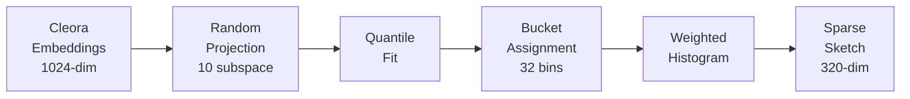

# Bank EMDE Session Sketch Generator

Bu doküman, Cleora embedding'lerinden zaman ağırlıklı ve yoğunluk tabanlı müşteri temsilleri (sketches) üreten `bank_emde_session.py` scriptini detaylı olarak açıklar.

---

## Amaç

Ham olay (event) vektörlerini, bir müşterinin tüm geçmişini özetleyen **sabit boyutlu** tek bir vektöre dönüştürmektir.

> [!IMPORTANT]
> EMDE, klasik "ortalama alma" (mean pooling) yönteminden farklı olarak müşterinin **davranış uzayındaki dağılımını** saklar. Bu sayede benzer davranış örüntüleri gösteren müşteriler embedding uzayında yakın konumlanır.

---

## Hızlı Başlangıç

```bash
source venv/bin/activate
python bank_emde_session.py
```

---

## DLSH Algoritması (Density-dependent LSH)

Mevcut implementasyon **DLSH** (Density-dependent Locality Sensitive Hashing) kullanır. Klasik LSH'den farkı, bucket sınırlarının verinin dağılımından **öğrenilmesidir**.

### Klasik LSH vs DLSH

| Özellik | Klasik LSH | DLSH |
|---------|------------|------|
| Bucket Sınırları | Random bias | **Quantile-based** |
| Boş Bucket | Olabilir | **Garanti yok** |
| Veri Dağılımı | Göz ardı | **Dikkate alınır** |
| Fit Gereksinimi | Yok | **Var** |

### DLSH Akışı



---

## DLSH Detaylı Açıklama

### Adım 1: Random Projection

Her subspace için tek bir rastgele projeksiyon vektörü oluşturulur:

```python
self.projections = []
for i in range(num_subspaces):  # 10 subspace
    r = np.random.randn(embed_dim)  # 1024-dim
    r = r / np.linalg.norm(r)  # Unit vector
    self.projections.append(r)
```

### Adım 2: Quantile Fit (Eğitim)

Tüm embedding'ler projekte edilir ve bucket sınırları **quantile fonksiyonundan** öğrenilir:

```python
def fit(self, embeddings: np.ndarray):
    quantile_percentages = np.linspace(0, 1, self.num_bins + 1)[1:-1]  # 31 sınır
    
    self.quantile_boundaries = []
    for i in range(self.num_subspaces):
        projected = embeddings @ self.projections[i]  # 1D projection
        boundaries = np.quantile(projected, quantile_percentages)
        self.quantile_boundaries.append(boundaries)
```


### Adım 3: Bucket Assignment

Yeni bir embedding için bucket indeksi, öğrenilmiş sınırlara göre belirlenir:

```python
def _compute_bucket(self, embeddings, subspace_idx):
    projected = embeddings @ self.projections[subspace_idx]
    boundaries = self.quantile_boundaries[subspace_idx]
    bucket_indices = np.searchsorted(boundaries, projected)
    return bucket_indices
```

### Adım 4: Weighted Sketch

Her embedding, time-decay ağırlığıyla bucket'lara katkı yapar:

```python
def create_weighted_sketch(self, embeddings, weights):
    sketch = np.zeros(self.sketch_dim)  # 10 × 32 = 320
    
    for i in range(self.num_subspaces):
        bucket_indices = self._compute_bucket(embeddings, i)
        for j, bucket in enumerate(bucket_indices):
            sketch_idx = i * self.num_bins + bucket
            sketch[sketch_idx] += weights[j]
    
    # L1 Normalize
    sketch = sketch / weights.sum()
    return sketch
```

---

## Konfigürasyon

| Parametre | Değer | Açıklama |
|-----------|-------|----------|
| **NUM_SUBSPACES** | 10 | Bağımsız projeksiyon sayısı |
| **NUM_BINS** | 32 | Her subspace'teki bucket sayısı |
| **Sketch Boyutu** | 320 | 10 × 32 = 320 dim ||

### Neden Bu Değerler?

- **10 Subspace**: Yeterli stabilite
- **32 Bin**: Bu veri için makaledekinden daha az bin yeterli


---

## Time Decay (Zaman Ağırlığı)

Yakın zamandaki olaylar daha önemlidir:

$$Weight = e^{-\lambda \times days\_ago}$$

| Gün Önce | Ağırlık (λ=0.02) |
|----------|------------------|
| 0 (bugün) | 100% |
| 10 | 81.9% |
| 25 | 60.7% |

---

## Past/Future UBR Ayrımı

```
┌─────────────────────────────────────────────────────────────┐
│                      30 Günlük Pencere                       │
├─────────────────────────────────────────┬───────────────────┤
│           PAST UBR (0-25 gün)           │ FUTURE UBR (25-30)│
│              Girdi (Input)              │   Hedef (Target)  │
│           Time-Decay Ağırlığı           │  Uniform Ağırlık  │
└─────────────────────────────────────────┴───────────────────┘
```

---

## Sketch Türleri

| Sketch | Kaynak | Ağırlık | Kullanım |
|--------|--------|---------|----------|
| **Past** | 0-25 gün event | Time-decay | FFN input |
| **Future** | 25-30 gün event | Uniform | FFN target |
| **Portfolio** | Sahip olunan ürünler | Uniform | FFN input |

---

## Çıktılar

`data/emde/emde_session_sketches_walkX.npz`:

| Değişken | Boyut | Açıklama |
|----------|-------|----------|
| `past_sketches` | (10000, 320) | Model girdisi |
| `future_sketches` | (10000, 320) | Model hedefi |
| `portfolio_sketches` | (10000, 320) | Statik ürün bilgisi |
| `churn_labels` | (10000,) | Churn durumu |
| `segments` | (10000,) | Müşteri segmenti |

---

## Performans Sonuçları

DLSH ile elde edilen sonuçlar:

| Metrik | Klasik LSH | DLSH |
|--------|------------|------|
| **Sparsity** | 96.9% | **67.5%** |
| **Churn ROC-AUC** | 0.50 | **0.9995** |
| **Churn F1** | 0.21 | **0.986** |

---

## Önemli Notlar

> [!NOTE]
> **Neden Müşteri Embedding'leri Kullanılmıyor?**
> 
> Cleora'dan gelen müşteri embedding'leri (`C_xxxx`) kullanılmaz. Sadece event ve product embedding'leri kullanılır. Amaç müşterinin **davranışlarından** temsil oluşturmaktır.

> [!NOTE]
> **DLSH Fit Gereksinimi**
> 
> DLSH kullanmadan önce `fit()` metodu çağrılmalıdır. Bu, product/event embedding'lerinin dağılımından quantile sınırlarını öğrenir.
